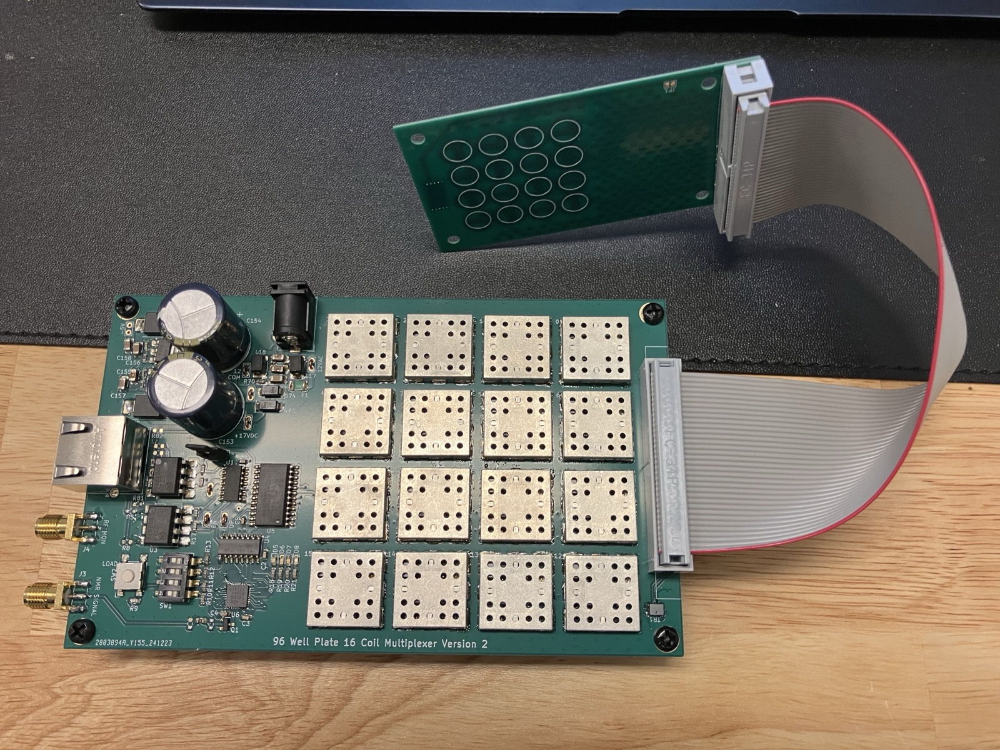

# Benchtop Wellplate Relaxometry Hardware

Hardware for the system described in "Rapid Parallel Magnetic Resonance Relaxometry on Multiwell Plates with a Benchtop Scanner", by Hans Gaensbauer, Yanmeng Yang, Daniel Roxby, David Bono, and Jongyoon Han.

Also see the 96wp branch of [the MR-Core Repo](https://github.com/hansgaensbauer/MR-Core). 

